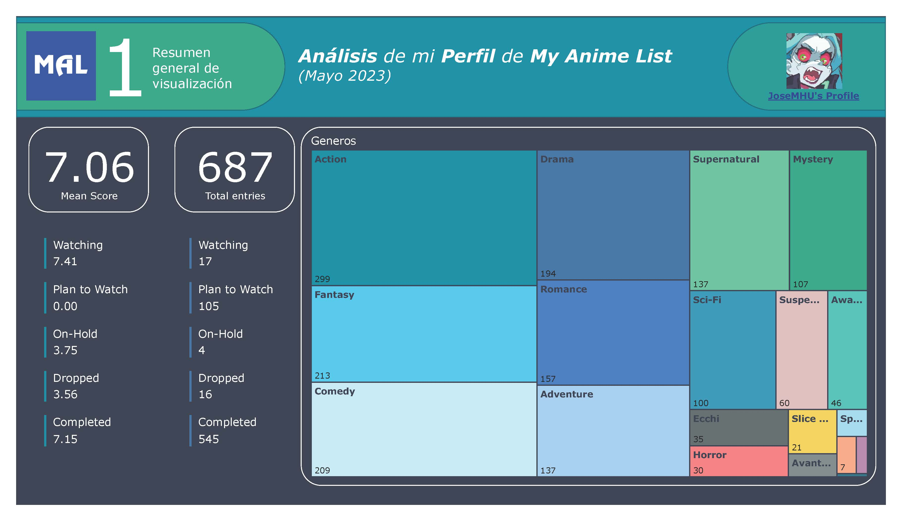
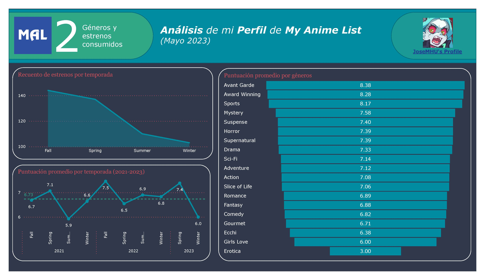

# Data extraction of profile in MAL
Repository that performs HTML queries based on the XML file that My Anime List exports. In addition, it creates CSV files with rich data that are easy to relate and consult with other tools such as Power Bi.

## What does this repository do?
This repository creates .csv files with data about the personal anime list you have on your My Anime List profile.
The files have:
### Main_table.csv file:
_* Anime ID | Title | Series type | Series episodes | Your personal score  | Your personal state | Anime state | Aired period | Premiere season | Studio_
### Genres_table.csv file:
_* Genre ID | Non-repeating list of genres you've seen_
### Relational_table.csv file:
_* Tabla ID | Anime ID | Genre ID_

## How does the code work?
1. With your account logged into My Anime List **[export your anime list.](https://myanimelist.net/panel.php?go=export)**
2. Install the additional modules in your Python development environment:
   * customtkinter
   * pandas
   * requests-HTML
3. Download the latest version from the repository **[(you can use the tags)](https://github.com/JoseMHU/Data-extraction-of-profile-in-MAL/tags)**.
4. Run the main file from root.
5. Wait a while based on the number of animes you have on your list. Once the queries are finished, the 3 final .csv files will be created on the desktop.

## What can I do with the data?
I made the repository to build a dataset to practice with in Power Bi, but you can use this repository to further analyze your taste in anime based on the data you've been updating in your MAL profile.

### Examples created with my MAL data in Power BI:

## Important
**A large volume of queries in a very short time to a web page can be interpreted as a malicious attack against the servers that host said web page.** So the page can either drop its HTML connection at runtime or install a manual antibot authentication check before entering the page.

This repository was created for academic purposes (it's my first GitHub project and my first Python repository), not with the intention of performing DDoS attacks.

### Current status of the project
Currently, to reduce the number of HTML queries made, the project has a local copy of the data extracted from My Anime List (the MAL_local_data.pkl file that is automatically created in the root of the module). Once the local file is created, the program only performs HTML queries to add new animes that are not found in the local file.

If you configure the variable "update" option of the "start" function in the "main" module, the program will make an HTML query about those animes that in the local file do not have their status as "Finished Airing".

By the very nature of this logic, if you run the code and then modify your list in My Anime List by removing an anime or changing the ratings you gave to an anime, you must manually delete the local file (MAL_local_data.pkl) for the program to build the data from 0. Otherwise, the program could crash due to an error in the number of data in the local file and the XML are different, plus it will never update the modified ratings of animes already in the local file with the status in "Finished Airing".
